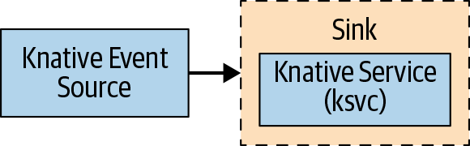
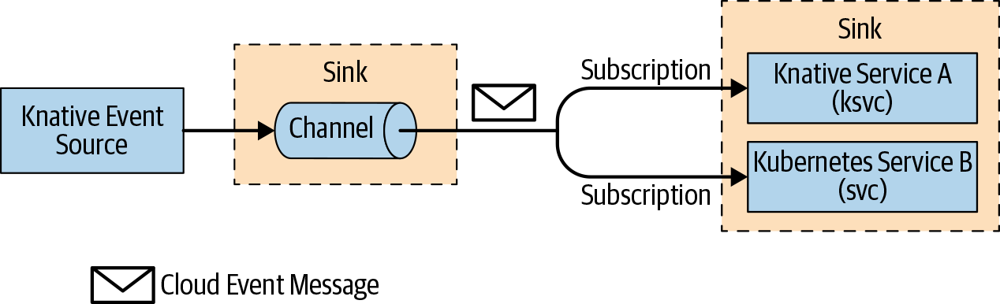
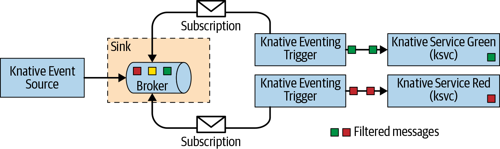

# Chapter 4. Knative Eventing
> ## CLOUDEVENTS
> CloudEvents is a specification for describing event data in a common way. An event might be produced by any number of sources (e.g., Kafka, S3, GCP PubSub, MQTT), and as a software developer, you want a common abstraction for all event inputs.

## Usage Patterns
There are three primary usage patterns with Knative Eventing:
### Source to Sink
Source to Sink provides the simplest getting started experience with Knative Eventing. It provides single ``Sink``—that is, event receiving service—with no queuing, backpressure, and filtering. Source to Sink does not support replies, which means the response from the Sink Service is ignored. As shown in Figure 4-1, the responsibility of the Event Source is just to deliver the message without waiting for the response from the Sink; hence, it will be appropriate to compare Source to Sink to the ``fire and forget`` messaging pattern.   
  
Figure 4-1. Source to Sink
### Channels and Subscriptions
With ``Channels and Subscriptions``, the Knative Eventing system defines a ``Channel``, which can connect to various backends such as In-Memory, Kafka, and GCP PubSub for sourcing the events. Each Channel can have one or more Subscribers in the form of Sink Services as shown in Figure 4-2, which can receive the event messages and process them as needed. Each message from the Channel is formatted as a ``CloudEvent`` and sent further up in the chain to other Subscribers for further processing. The Channels and Subscriptions usage pattern does not have the ability to filter messages.
  
Figure 4-2. Channels and Subscriptions
### Brokers and Triggers
``Brokers`` and ``Triggers`` are similar to Channels and Subscriptions, except that they support filtering of events. Event filtering is a method that allows the Subscribers to show an interest in a certain set of messages that flows into the Broker. For each Broker, Knative Eventing will implicitly create a Knative Eventing Channel. As shown in Figure 4-3, the Trigger gets itself subscribed to the Broker and applies the filter on the messages on its subscribed Broker. The filters are applied on the CloudEvent attributes of the messages, before delivering the message to the interested Sink Services (Subscribers).
  
Figure 4-3. Brokers and Triggers

## Before You Begin
All the recipes in this chapter will be executed from the directory $BOOK_HOME/eventing, so change to the recipe directory by running:
```bash
$ cd $BOOK_HOME/eventing
```

The recipes in this chapter will be deployed in the chapter-4 namespace, so switch to the chapter-4 namespace with the following command:
```bash
$ kubectl config set-context --current --namespace=chapter-4
```
The recipes in this chapter will enable us to do **eventing** with Knative and will help us in understanding how Knative Serving Services can respond to external events via Knative Eventing.
## 4.1 Producing Events with Eventing Sources
### Problem
You need a way to connect to and receive events into your application.

### Solution
Knative Eventing Sources are software components that emit events. The job of a Source is to connect to, drain, capture, and potentially buffer events, often from an external system, and then relay those events to the Sink.

Knative Eventing Sources install the following four sources out-of-the-box:  
old version
```bash
$ kubectl api-resources --api-group=sources.eventing.knative.dev
NAME              APIGROUP                      NAMESPACED   KIND
apiserversources  sources.eventing.knative.dev  true         ApiServerSource
containersources  sources.eventing.knative.dev  true         ContainerSource
cronjobsources    sources.eventing.knative.dev  true         CronJobSource
sinkbindings      sources.eventing.knative.dev  true         SinkBinding
```
2022.02.17 version is  1.12 
```bash
kubectl api-resources --api-group='sources.knative.dev'
NAME               SHORTNAMES   APIVERSION               NAMESPACED   KIND
apiserversources                sources.knative.dev/v1   true         ApiServerSource
containersources                sources.knative.dev/v1   true         ContainerSource
pingsources                     sources.knative.dev/v1   true         PingSource
sinkbindings                    sources.knative.dev/v1   true         SinkBinding
```
## 4.3 Deploying a Knative Eventing Service
### Problem
Your Knative or Kubernetes Service needs to receive input from Knative Eventing in a generic fashion, as events may come from many potential sources.

### Solution
Your code will handle an HTTP POST as shown in the following listing, where the CloudEvent data is available as HTTP headers as well as in the body of the request:
```java
  @PostMapping("/")
  public ResponseEntity<String> myPost (
    HttpEntity<String> http) {

    System.out.println("ce-id=" + http.getHeaders().get("ce-id"));
    System.out.println("ce-source=" + http.getHeaders().get("ce-source"));
    System.out.println("ce-specversion=" + http.getHeaders()
                                               .get("ce-specversion"));
    System.out.println("ce-time=" + http.getHeaders().get("ce-time"));
    System.out.println("ce-type=" + http.getHeaders().get("ce-type"));
    System.out.println("content-type=" + http.getHeaders().getContentType());
    System.out.println("content-length=" + http.getHeaders().getContentLength());

    System.out.println("POST:" + http.getBody());
  }
```
The [CloudEvent SDK](https://github.com/cloudevents) provides a class library and framework integration for various language runtimes such as Go, Java, and Python.

Additional details on the CloudEvent to HTTP mapping can be found in the [CloudEvent GitHub](https://github.com/cloudevents/spec/) repository.

The following listing shows a simple Knative Service (Sink):
```yaml
apiVersion: serving.knative.dev/v1alpha1
kind: Service
metadata:
  name: eventinghello
spec:
  template:
    metadata:
      name: eventinghello-v1
      annotations:
        autoscaling.knative.dev/target: "1" ❶ 
    spec:
      containers:
      - image: quay.io/rhdevelopers/eventinghello:0.0.1
```
❶  A concurrency of 1 HTTP request (an event) is consumed at a time. Most applications/services can easily handle many events concurrently and Knative’s out-of-the-box default is 100. For the purposes of experimentation, it is interesting to see the behavior when you use 1 as the autoscaling target.
### Discussion
[Refererence](https://redhat-developer-demos.github.io/knative-tutorial/knative-tutorial/eventing/eventing.html#eventing-watch-logs)

You can deploy and verify that the ``eventinghello`` Sink Service has been deployed successfully by looking for ``READY`` marked as ``True``:
```bash
$ kubectl -n chapter-4 apply -f eventing-hello-sink.yaml
service.serving.knative.dev/eventinghello created
$ kubectl get ksvc
NAME            URL                                                      LATESTCREATED         LATESTREADY           READY   REASON
eventinghello   http://eventinghello.chapter-4.192.168.59.200.sslip.io   eventinghello-00001   eventinghello-00001   True
```
The default behavior of Knative Serving is that the very first deployment of a Knative Serving Service will automatically scale up to one pod, and after about 90 seconds it will autoscale down to zero pods.

You can actively watch the pod lifecycle with the following command:
```bash
$ kubectl get pods -w
```
You can monitor the logs of the eventinghello pod with:
```bash
$ stern eventinghello -c user-container
```
Wait until eventinghello scales to zero pods before moving on.The logs will have the output like below printing every 2 minutes.
```bash
eventinghello-00001-deployment-5897f8b497-bbnmq user-container 2022-02-17 01:02:00,186 INFO  [eventing-hello] (executor-thread-1) ce-id=d54ae831-ba74-47e0-83bb-337df83e0344
eventinghello-00001-deployment-5897f8b497-bbnmq user-container 2022-02-17 01:02:00,186 INFO  [eventing-hello] (executor-thread-1) ce-source=/apis/v1/namespaces/chapter-4/pingsources/eventinghello-ping-source
eventinghello-00001-deployment-5897f8b497-bbnmq user-container 2022-02-17 01:02:00,188 INFO  [eventing-hello] (executor-thread-1) ce-specversion=1.0
eventinghello-00001-deployment-5897f8b497-bbnmq user-container 2022-02-17 01:02:00,188 INFO  [eventing-hello] (executor-thread-1) ce-time=2022-02-17T01:02:00.165087764Z
eventinghello-00001-deployment-5897f8b497-bbnmq user-container 2022-02-17 01:02:00,188 INFO  [eventing-hello] (executor-thread-1) ce-type=dev.knative.sources.ping
eventinghello-00001-deployment-5897f8b497-bbnmq user-container 2022-02-17 01:02:00,188 INFO  [eventing-hello] (executor-thread-1) content-type=null
eventinghello-00001-deployment-5897f8b497-bbnmq user-container 2022-02-17 01:02:00,189 INFO  [eventing-hello] (executor-thread-1) content-length=48
eventinghello-00001-deployment-5897f8b497-bbnmq user-container 2022-02-17 01:02:00,202 INFO  [eventing-hello] (executor-thread-1) POST:{"message": "Thanks for doing Knative Tutorial"}
```
## 4.4 Connecting a Source to the Service
### Problem
You have a Knative Serving Service (Sink) and need to connect it to a Knative Eventing Source to test its autoscaling behavior.
### Solution
[Refererence](https://redhat-developer-demos.github.io/knative-tutorial/knative-tutorial/eventing/eventing-src-to-sink.html#eventing-source)

Deploy a ``PingSource`` ( ``CronJobSource`` ), as it is the easiest solution to verify if Knative Eventing is responding to events correctly. To deploy a ``PingSource`` ( ``CronJobSource`` ), run the following command:
```bash
$ kubectl -n chapter-4 apply -f eventinghello-source.yaml
cronjobsource.sources.eventing.knative.dev/eventinghello-cronjob-source created
```
or
```bash
kn source ping create eventinghello-ping-source \
  --schedule "*/2 * * * *" \
  --data '{"message": "Thanks for doing Knative Tutorial"}' \
  --sink ksvc:eventinghello
```
#### Verification
```bash
$ kubectl -n chapter-4 get pingsources
NAME                        SINK                                               SCHEDULE      AGE    READY   REASON
eventinghello-ping-source   http://eventinghello.chapter-4.svc.cluster.local   */1 * * * *   3m5s   True

$ kn -n chapter-4 source ping list
NAME                        SCHEDULE      SINK                 AGE    CONDITIONS   READY   REASON
eventinghello-ping-source   */1 * * * *   ksvc:eventinghello   102m   3 OK / 3     True

```
#### Cleanup
```bash
kubectl delete -f eventinghello-source.yaml
kubectl delete -f eventing-hello-sink.yaml
```
or
```bash
kn source ping delete eventinghello-ping-source
kn service delete eventinghello
```
## 4.x Channel and Subscribers
#### Channels
[Refer](https://redhat-developer-demos.github.io/knative-tutorial/knative-tutorial/eventing/channel-and-subscribers.html#eventing-channel)  
Channels are an event forwarding and persistence layer where each channel is a separate Kubernetes Custom Resource. A Channel may be backed by Apache Kafka or InMemoryChannel. This recipe focuses on InMemoryChannel.

#### Subscriptions
Subscriptions are how you register your service to listen to a particular channel.

### Channel(Sink)
The [channel or sink](https://en.wikipedia.org/wiki/Event-driven_architecture#Event_channel) is an interface between the event source and the subscriber. The channels are built in to store the incoming events and distribute the event data to the subscribers. When forwarding event to subscribers the channel transforms the event data as per CloudEvent specification.

#### Create Event Channel
Run the following commands to create the channel:
```bash
kubectl apply -f  eventing/channel.yaml
```
or
```bash
kn channel create eventinghello-ch
NAME               URL                                                              AGE     READY   REASON
eventinghello-ch   http://eventinghello-ch-kn-channel.chapter-4.svc.cluster.local   6m16s   True
```

Verification
```bash
kubectl get channels.messaging.knative.dev
```
or
```bash
kn channel list
NAME               TYPE              URL                                                              AGE     READY   REASON
eventinghello-ch   InMemoryChannel   http://eventinghello-ch-kn-channel.chapter-4.svc.cluster.local   5m55s   True
```
 
### Event Source
[Refer](https://redhat-developer-demos.github.io/knative-tutorial/knative-tutorial/eventing/channel-and-subscribers.html#eventing-source)  
The event source listens to external events e.g. a kafka topic or for a file on a FTP server. It is responsible to drain the received event(s) along with its data to a configured sink.
#### Create Event Source
Run the following commands to create the event source resources:
```bash
kubectl apply -f event-source.yaml
```
or
```bash
kn source ping create event-greeter-ping-source \
  --schedule "*/2 * * * *" \
  --sink channel:eventinghello-ch
```

Verification
```bash
kubectl get pingsource.sources.knative.dev
NAME                        SINK                                                             SCHEDULE      AGE   READY   REASON
event-greeter-ping-source   http://eventinghello-ch-kn-channel.chapter-4.svc.cluster.local   */2 * * * *   42s   True
```
or
```bash
kn source ping list
NAME                        SCHEDULE      SINK                       AGE   CONDITIONS   READY   REASON
event-greeter-ping-source   */2 * * * *   Channel:eventinghello-ch   12s   3 OK / 3     True
```
### Event Subscriber
[Refer](https://redhat-developer-demos.github.io/knative-tutorial/knative-tutorial/eventing/channel-and-subscribers.html#eventing-subscriber)  
The event subscription is responsible of connecting the channel(sink) with the service. Once a service is connected to a channel it starts receiving the events (cloud events)
#### Create Subscriber Services
##### Deploy eventing-helloa-sink
```bash
kubectl apply -f  eventing-helloa-sink.yaml
```
or
```bash
kn service create eventinghelloa \
  --concurrency-target=1 \
  --revision-name=eventinghelloa-v1 \
  --image=quay.io/rhdevelopers/eventinghello:0.0.2
```
##### Deploy eventing-hellob-sink
```bash
kubectl apply -f  eventing-hellob-sink.yaml
```
or
```bash
kn service create eventinghellob \
  --concurrency-target=1 \
  --revision-name=eventinghellob-v1 \
  --image=quay.io/rhdevelopers/eventinghello:0.0.2
```
#### Create Channel Subscribers
##### Subscribe to eventinghelloa
```bash
kubectl apply -f  eventing-helloa-sub.yaml
```
or
```bash
kn subscription create eventinghelloa-sub \
  --channel eventinghello-ch \
  --sink eventinghelloa
```
##### Subscribe to eventinghellob
```bash
kubectl apply -f  eventing-hellob-sub.yaml
```
or
```bash
kn subscription create eventinghellob-sub \
  --channel eventinghello-ch \
  --sink eventinghellob
```
##### Verification
```bash
kubectl get subscription.messaging.knative.dev

NAME                 AGE   READY   REASON
eventinghelloa-sub   26s   True
eventinghellob-sub   6s    True
```
or
```bash
kn subscription list

NAME                 CHANNEL                    SUBSCRIBER            REPLY   DEAD LETTER SINK   READY   REASON
eventinghelloa-sub   Channel:eventinghello-ch   ksvc:eventinghelloa                              True
eventinghellob-sub   Channel:eventinghello-ch   ksvc:eventinghellob                              True
```
#### Cleanup
```bash
kubectl delete -f eventing-helloa-sink.yaml
kubectl delete -f eventing-helloa-sub.yaml
kubectl delete -f eventing-hellob-sink.yaml
kubectl delete -f eventing-hellob-sub.yaml
kubectl delete -f event-source.yaml
kubectl delete -f channel.yaml
```
or
```bash
kn service delete eventinghelloa
kn subscription delete eventinghelloa-sub
kn service delete eventinghellob
kn subscription delete eventinghellob-sub
kn source ping delete event-greeter-ping-source
kn channel delete eventinghello-ch
```